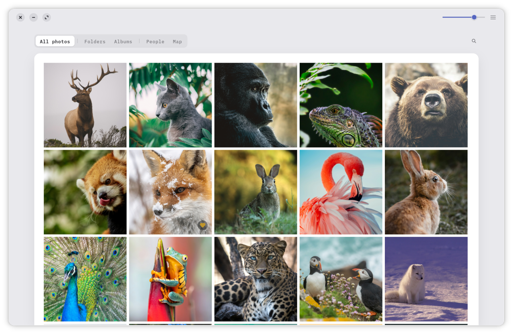
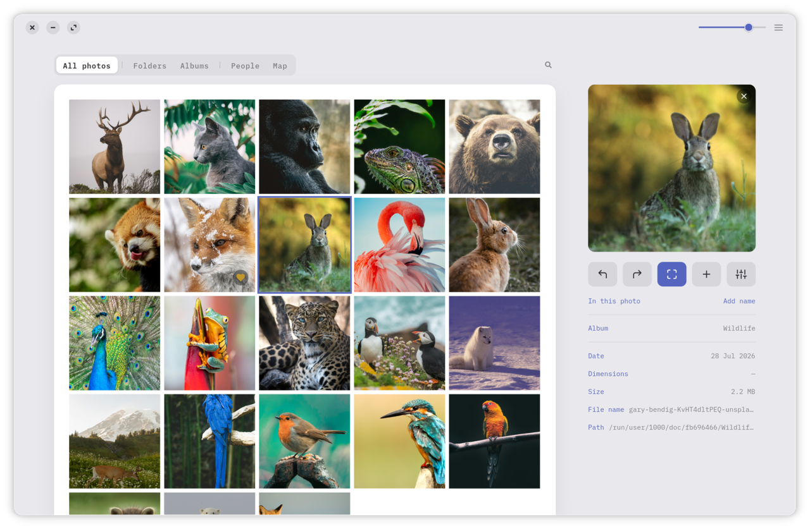
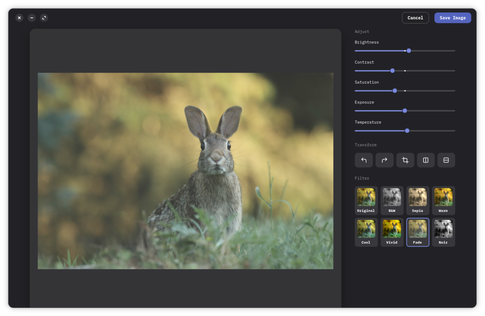

<p align="center">
  
</p>

<h1 align="center">Easel</h1>

<p align="center">
  A calm, offline gallery for the photos you already own —<br>
  no accounts, no cloud, no noise. Just your pictures, beautifully laid out.
</p>

<p align="center">
  
</p>

Easel scans your photo folders into a local library and lays them out on a
clean paper card. Browse everything at once or by folder, album, person or
place; open any photo full-window; and make quick edits that never touch the
original file.

<p align="center">
  
  
</p>

## Features

**See your photos**
- **Every photo at once**, or grouped into **Folders, Albums, People** and a **Map**
- A **full-window lightbox** with left/right and keyboard navigation
- **Favourites**, kept apart in their own view

**Edit, without touching the original**
- **Non-destructive adjustments**: brightness, contrast, saturation, exposure
  and temperature
- **Rotate, flip and crop**, plus one-tap filters — B&amp;W, Sepia, Warm, Cool,
  Vivid, Fade and Noir
- Saves a **new copy** and **preserves your EXIF** data

**Built for real libraries**
- **HEIC and video** support, with video thumbnails
- Your photos placed on an **offline OpenStreetMap** — no tiles ever fetched
- Sorted by **EXIF capture date**; **folder watching**; **Move to Trash** through
  the desktop portal
- **It remembers** window size and last tab; light and dark themes that follow
  the system

## Install

Grab the latest `.flatpak` bundle from the
[**Releases**](https://github.com/DrVonMiau/easel/releases) page, then install
and run it:

```sh
flatpak install --user io.github.drvonmiau.Easel.flatpak
flatpak run io.github.drvonmiau.Easel
```

The first command may offer to pull in the GNOME runtime the app needs — say
yes. You only need [Flatpak](https://flatpak.org/setup/) installed, which most
Linux distributions already have.

## Building from source

Open the project in **GNOME Builder** and press Run — the included Flatpak
manifest (`io.github.drvonmiau.Easel.json`) takes care of everything, including
the IBM Plex fonts the design uses.

Or with `flatpak-builder` directly:

```sh
flatpak-builder --user --install --force-clean _flatpak io.github.drvonmiau.Easel.json
flatpak run io.github.drvonmiau.Easel
```

## Part of a family

Easel is one of three sibling apps that share a design language — the same calm,
offline-first idea recast for different libraries:

- 🖼️ **Easel** — your photos *(you are here)*
- 🎵 [**Lyre**](https://github.com/DrVonMiau/lyre) — your music
- 📖 [**Quill**](https://github.com/DrVonMiau/quill) — your reading

## Built with

GTK4 · libadwaita · PyGObject, packaged as a Flatpak on the GNOME runtime.

## License

Easel is free software, released under the
[GNU GPL 3.0 or later](COPYING).
